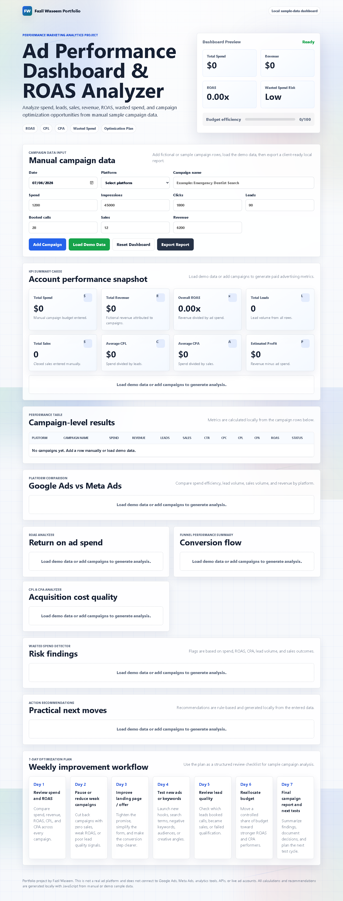

# Ad Performance Dashboard & ROAS Analyzer

A polished frontend dashboard for analyzing sample/manual ad campaign data, calculating paid advertising metrics, identifying weak campaigns, detecting wasted spend risks, and generating practical optimization recommendations.

Live demo placeholder:  
https://fazilprojects.github.io/ad-performance-dashboard-roas-analyzer/

## Screenshot



`ad-performance-dashboard-roas-analyzer-dashboard.png`

## Project Purpose

This portfolio project was created for Fazil Waseem, an aspiring Performance Marketer learning Google Ads, Meta Ads, lead generation, ecommerce marketing, conversion rate optimization, campaign analytics, and AI-assisted marketing systems.

The project demonstrates how marketing data can be converted into useful reporting, ROAS analysis, funnel insight, and campaign optimization actions using only local frontend code.

## What It Does

- Accepts manual campaign data.
- Loads realistic fictional demo campaign data.
- Calculates CTR, CPC, CPL, cost per booked call, CPA, lead conversion rate, sales conversion rate, ROAS, and estimated profit.
- Highlights best and worst campaigns.
- Compares Google Ads and Meta Ads performance.
- Flags wasted spend risks.
- Generates practical action recommendations.
- Creates a 7-day optimization plan.
- Exports a local text report.

## Key Features

- Campaign performance data table
- Add campaign row manually
- Load demo campaign data
- Reset dashboard
- Export report
- KPI summary cards
- ROAS analyzer
- CPL and CPA analysis
- Wasted spend detector
- Budget efficiency score
- Best campaign and worst campaign highlight
- Google Ads vs Meta Ads platform comparison
- Funnel performance summary
- Action recommendations
- 7-day optimization plan

## Test Example

Open the dashboard and click **Load Demo Data**. The app will populate eight fictional dental campaign rows across Google Ads and Meta Ads, then generate KPIs, campaign status labels, platform comparison, wasted spend findings, recommendations, and a report export.

## Tech Stack

- HTML5
- CSS3
- Vanilla JavaScript
- No external frameworks
- No external APIs
- GitHub Pages compatible

## Folder Structure

```text
ad-performance-dashboard-roas-analyzer/
├── index.html
├── style.css
├── script.js
├── README.md
├── AGENTS.md
└── docs/
    ├── PROJECT_BRIEF.md
    ├── DESIGN_SYSTEM.md
    └── CONTENT.md
```

## How to Run Locally

Open `index.html` directly in a browser.

No build process, package install, account login, API key, or server is required.

## Portfolio Positioning

This is a local JavaScript marketing analytics dashboard and portfolio project. It should not be presented as a real ad platform, analytics integration, automated media buying system, or live AI analysis product.

All calculations and recommendations are generated locally from manual or sample data.

## Future Improvements

- CSV import and export
- Editable campaign rows
- Saved local browser sessions with localStorage
- More detailed charts
- Separate ecommerce and lead generation analysis modes
- Custom target ROAS, CPL, and CPA thresholds
- PDF-style print report
- More advanced recommendation rules

## Author

Fazil Waseem  
Aspiring Performance Marketer focused on Google Ads, Meta Ads, lead generation, campaign analytics, CRO, ecommerce marketing, and AI-assisted marketing workflows.
